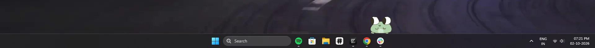

# Little Guy
Little guy is a cute pet that lives in your taskbar, it can connect with other programs like pixl, and many other coming soon!
It naps, wander, waves and follows your mouse 🤩


You can play games with it (soon to be added) like Tic Tac Toe, and other fun mini games.


## Features
- **Animated** : All the spirtes are hand animated and render using PySide6
- **Brain** : Picks between idle, walking and napping based on energy, boredom, time of day and cooldowns
- **Connectors** : Connects to other programs like pixl and notify you about different things
> The backend server is currently down because of the current [nest](https://nest.hackclub.com) situation, it will come online once nest becomes stable

## Installation
### Running locally
Clone the repo
```bash
git clone https://github.com/ridit-jangra/Little-Guy
```

Install required dependencies
```bash
pip install -r requirements.txt
```

Run the dev script that auto-reloads on changes
```bash
python dev.py
```

Running the `backend server`

```bash
cd server
pip install -r requirements.txt
cp .env.example .env
python main.py
```

`.env` structure
| Variable | Purpose |
| --- | --- |
| `HCA_CLIENT_ID`, `HCA_CLIENT_SECRET` | Hack Club Auth OAuth credentials |
| `PUBLIC_URL` | Public URL of the server |
| `PIXL_API_KEY` | Comma-separated API keys allowed to send messages |
| `PORT` | Listen port (default `8080`) |

`server/send_test.py` can be used to send a test message.

---

### Installing binaries
Go to [Github Releases](https://github.com/ridit-jangra/Little-Guy/releases) and install Linux or Windows build.

#### Installing linux build
```bash
chmod +x LittleGuy-Linux
./LittleGuy-Linux
```

#### Installing windows build
Download the .exe installer and follow the steps, after installing the installer will run Little Guy and register it as an auto-start application.

## Building

Releases are built by GitHub Actions (`.github/workflows/build.yml`) on `v*` tags:

### Building binaries locally
```sh
pip install -r build-requirements.txt
pyinstaller build.spec
```

## License

See [LICENSE](LICENSE).
